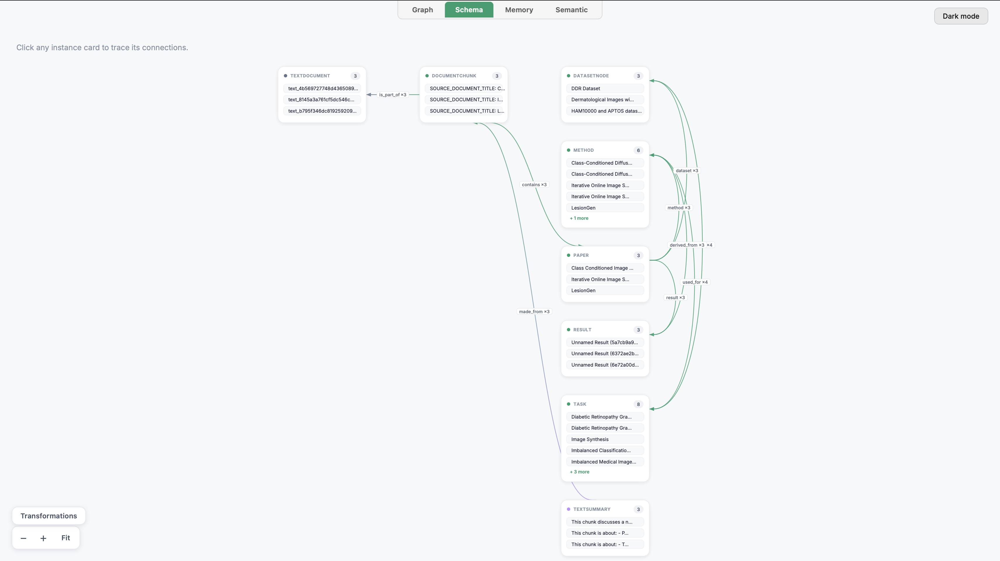

# NovelGraph

> Turning a folder of research papers into a typed knowledge graph, then using structural graph analysis and an agentic verification loop to propose and ground novel research directions.

NovelGraph ingests research papers into a **typed entity graph** (Paper, Method, Dataset, Task, Result), detects **Method ↔ Dataset combinations that have never been tried together but are structurally close** (via shared-neighbor analysis and lexical task clustering), and then runs a **multi-hop reasoning + dual-agent verification loop** to turn each candidate pair into an evidence-backed hypothesis — with every citation checked against the literal graph, not just plausible-sounding.

## Why this exists

Literature review doesn't scale past a few dozen papers. A researcher can hold maybe 10-15 papers' worth of Method/Dataset combinations in their head at once; a real corpus has hundreds. The interesting question isn't "what did paper X do" — it's "what combination of an existing method and an existing dataset has *nobody tried yet*, even though they're one hop apart in the literature." That's a graph-structure question, not a summarization question, which is why this is built around explicit typed nodes and edges rather than a flat vector index.

## How it works

```
Papers (PDF/DOCX/PPTX/TXT/MD/CSV)
        │
        ▼
┌────────────────────┐   1. Typed schema        Paper --method--> Method
│ Graph Construction │   2. Chunked extraction  Paper --dataset-> DatasetNode
│ (typed DataPoints) │      + incremental       DatasetNode --tasks--> Task
└────────────────────┘        ingestion          Method --used_for--> Task
        │                                       Result --derived_from--> Method
        ▼
┌────────────────────┐   3. Untested (Method, Dataset) pairs ranked by
│ Novelty Detection  │      shared structural neighbors (common Task),
│(structural, local) │      with Jaccard-clustered task names and a
└────────────────────┘      lexical-similarity tiebreaker — zero LLM calls
        │
        ▼
┌────────────────────┐   4. Multi-hop chain-of-thought retrieval proposes
│ Hypothesis Seeding │      a first-draft hypothesis across the graph
└────────────────────┘
        │
        ▼
┌────────────────────┐   5/6. Temporal/prior-art check, then a Generator/
│ Agentic Refinement │       Critic loop (LangGraph) where the Critic
│ (Generator/Critic) │       rejects any citation that isn't an exact,
└────────────────────┘       literal node/edge identity in the graph
        │
        ▼
┌────────────────────┐   7/8. Provenance-grounded evidence bullets pulled
│ Evidence & Report  │       from triplet-level retrieval, plus run-level
└────────────────────┘       evaluation metrics (approval rate, evidence
                             coverage, novelty scores)
```

**Design choices worth calling out:**

- **No direct Method↔Dataset edge in the schema.** A Paper is what links a Method and a Dataset. This is deliberate: it's exactly what makes "these two are structurally close but never directly connected" a well-defined, computable condition rather than a fuzzy semantic judgment.
- **Task-name clustering, not exact-match.** The same real-world task shows up as different literal strings across papers ("skin lesion classification" vs. "medical image classification"). Greedy single-pass clustering by Jaccard word-overlap merges these before joining Method/Dataset pairs on a shared Task, without ever calling an embedding API for it.
- **Citation grounding is enforced, not assumed.** Both agent prompts define a valid citation as an *exact* node/edge identity as it appears in the graph — not a paraphrase of a node's description. A logged production run surfaced exactly the failure mode this guards against: an invented phrase that sounded plausible enough to pass a naive check.
- **Cost-aware by construction.** Content-hash deduplication at ingestion, pipeline-status dedup at graph-build time, and a persisted run-history log mean re-running the pipeline never re-spends LLM/embedding calls on papers or (Method, Dataset) pairs already processed.

### Graph visualization

Every pipeline run also writes an interactive HTML visualization of the constructed graph.



## Example run

Fed 3 papers on diffusion-based synthetic data generation for imbalanced medical image classification (diabetic retinopathy grading and skin lesion classification):

1. [Iterative Online Image Synthesis via Diffusion Model for Imbalanced Classification](https://papers.miccai.org/miccai-2024/paper/0901_paper.pdf)
2. [Class-Conditioned Image Synthesis with Diffusion for Imbalanced Diabetic Retinopathy Grading](https://papers.miccai.org/miccai-2025/paper/4449_paper.pdf)
3. [LesionGen: A Concept-Guided Diffusion Model for Dermatology Image Synthesis](https://workshop.isic-archive.com/2025/paper_fayyad.pdf)

The pipeline surfaced 3 candidate (Method, Dataset) pairs. The Critic approved 1 and rejected 2 - which is the verification loop doing its job, not a failure rate to minimize.

**Approved:** *Iterative Online Image Synthesis (IOIS) × DDR Dataset*

IOIS - originally validated on the HAM10000 and APTOS datasets - uses classifier-gradient feedback to guide diffusion-based synthesis, plus accuracy-adaptive sampling that assigns more synthetic samples to whichever class the classifier currently handles worst. The DDR Dataset (a different diabetic retinopathy corpus, never paired with IOIS in any ingested paper) has the same severe class-imbalance problem, and a class-conditioned diffusion baseline was already shown to lift its balanced accuracy from ~66.8% to ~74.2%. The generated hypothesis proposes that IOIS's classifier-aware, iterative synthesis should extend that same gain further, and every cited claim ("Node: Iterative Online Image Synthesis (IOIS)", "Node: DDR Dataset", "Node: Diabetic Retinopathy Grading", etc.) resolved to an exact entity in the graph, so the Critic approved it. Evidence assembly then pulled section-level citations grounding each claim back to the source PDFs (e.g. the DDR balanced-accuracy figures traced to a specific results table).

**Rejected:** *Class-Conditioned Diffusion Model Finetuning with Semantic Quality Filtering × Dermatological Images with Concept-Guided Captions*

This pairing looked plausible on the surface - both are diffusion-based synthesis methods for imbalanced medical imaging. But that specific finetuning method was only ever described in the graph as applied to retinal fundus images for diabetic retinopathy grading; the dermatological-captions dataset was linked instead to a *different* method (LesionGen). The Critic's verdict was direct: *"There is no exact node or relationship indicating that [this method] is applied to... the 'Dermatological Images with Concept-Guided Captions' dataset."* No citation-splicing or approximate matching allowed it through - which is exactly the failure mode the grounding rule exists to catch.

## Evaluation

`eval.py` computes run-level metrics with zero additional LLM/embedding calls, from the report a completed run already produced. A real 3-paper run:

```
============================================================
EVALUATION SUMMARY
============================================================
Pairs evaluated:      3
Approval rate:        33%  (Critic verified every cited claim against the graph)
Evidence coverage:    100%  (approved hypotheses with >=1 citable evidence bullet)
Avg shared neighbors: 0.0  (structural novelty signal, from novelty.py)
Avg lexical similarity: 0.112  (description-overlap proxy for embedding similarity)
Cumulative across all logged runs (run_history.jsonl): 3 pairs verified, 3 unique, 33% approval rate.
```

What these numbers actually say about this particular run:

- **Approval rate (33%)** is the fraction of candidate pairs whose every cited claim resolved to an exact graph entity - a cheap, mechanical proxy for "grounded, not hallucinated," computed with no ground truth needed. On a 3-paper corpus, 1-in-3 approved is a healthy signal that the Critic is actually rejecting things, not rubber-stamping.
- **Evidence coverage (100%)** means the one approved hypothesis also got at least one citable evidence bullet from Stage 7 - approved-in-principle and actually-citable aren't the same thing, and this run's approved pair was both.
- **Avg shared neighbors (0.0)** reveals something specific about *this* run: with only 3 papers, no two Method/Dataset pairs shared an explicit Task node, so `novelty.py`'s exploratory fallback (ranking by Method/Dataset description overlap instead) supplied the candidates. On a larger corpus, this number should climb above 0 as shared-Task structure emerges.
- **Avg lexical similarity (0.112)** is the Jaccard word-overlap between the chosen Method's and Dataset's description text - low here because the fallback path optimizes for *some* overlap, not high overlap.

Every logged run also updates `run_history.jsonl` (cumulative stats above), so re-running the pipeline over an expanding paper corpus builds a running approval-rate trend, not just a single-run snapshot.

## Project layout

```
├── src/novelgraph/          # Installable package — all core logic
│   ├── schema.py            # Typed DataPoint graph schema
│   ├── config.py            # Auto-resolves Cognee's storage paths to this project's own folder
│   ├── ingest.py            # PDF preprocessing + incremental ingestion
│   ├── pdf_preprocess.py    # Layout/table-aware PDF -> markdown, optional figure captioning
│   ├── graph_store.py       # Zero-cost reads of the graph via Cognee's own graph-engine accessor
│   ├── novelty.py           # Structural novelty detection + task clustering
│   ├── temporal.py          # Prior-art / "has this been tried before year X" checks
│   ├── hypothesis.py        # Multi-hop chain-of-thought hypothesis seeding
│   ├── agents.py            # LangGraph Generator/Critic verification loop
│   ├── evidence.py          # Triplet-level evidence/citation assembly
│   ├── eval.py              # Run-level evaluation metrics
│   ├── run_history.py       # Persistent verdict log (JSONL, append-only)
│   ├── search_utils.py      # Parses the graph engine's raw search response shape
│   ├── chat.py              # Conversational Q&A over the ingested graph
│   └── pipeline.py          # End-to-end orchestration used by scripts/main.py
├── scripts/                 # Thin CLI entry points around the package
│   ├── main.py               # Full pipeline: ingest -> novelty -> hypothesis -> verify -> report
│   ├── chat_cli.py           # Terminal REPL for Q&A over the graph
│   ├── smoke_test.py         # Cheap end-to-end sanity check (pennies, not your real corpus)
│   ├── debug_novelty.py      # Re-run novelty detection against the existing graph, zero cost
│   └── inspect_db.py         # Dump live graph-engine data + the SQLite metadata store
├── app.py                   # Streamlit UI (upload, chat, discover, graph explorer)
├── docs/graph_screenshot.png # (add your own) screenshot of graph_debug.html, used in the README
├── data/papers/              # Drop research papers here
├── pyproject.toml
└── .env.example
```

## Setup

This project uses [`uv`](https://docs.astral.sh/uv/) for dependency management.

```bash
git clone https://github.com/ayushraj09/novelgraph.git
cd novelgraph

uv sync                 # creates .venv and installs everything from pyproject.toml
cp .env.example .env    # fill in your OpenAI key and storage paths
```

### Sanity check first (costs pennies)

```bash
uv run scripts/smoke_test.py
```

This ingests two tiny inline documents, then runs novelty detection and the temporal check against that toy graph so you can confirm the wiring works before spending real API cost on your own papers.

### Run the full pipeline

```bash
# Drop PDFs/DOCX/PPTX/TXT/MD/CSV into data/papers/, then:
uv run scripts/main.py

# Re-run without re-ingesting (reuse the existing graph):
SKIP_INGEST=true uv run scripts/main.py

# Force a full rebuild (e.g. after changing schema.py):
RESET_GRAPH=true uv run scripts/main.py
```

### Chat with your papers

```bash
uv run scripts/chat_cli.py
```

### Interactive UI

```bash
uv run streamlit run app.py
```

A local Streamlit front-end over the same pipeline above (`novelgraph.ingest`, `novelgraph.novelty`, `novelgraph.temporal`, `novelgraph.agents`, `novelgraph.evidence`, `novelgraph.eval`, `novelgraph.run_history`, `novelgraph.chat`) - it doesn't reimplement any of the logic, just wraps it with a UI. See below for a full tour.

## Streamlit UI

### What's in each tab

- **Upload & Ingest**: drag in papers (PDF/DOCX/PPTX/TXT/MD/CSV). PDFs get the same pymupdf4llm pre-parsing as the CLI. Ingestion is incremental - re-uploading an already-ingested paper costs nothing further.
- **Chat**: same `GRAPH_COMPLETION` flow as `scripts/chat_cli.py`, including the paper inventory shortcut and short in-session memory, just rendered as a chat UI instead of a terminal loop. Use this to sanity-check ingestion and explore *before* running the expensive Novelty pipeline - it's a single LLM call per question, versus 6+ per pair in the pipeline below.
- **Novelty & Hypotheses**: runs Stages 3-8, in two modes:
  - *Auto-discover top pairs* - `novelty.py`'s shared-Task heuristic ranks candidate (Method, Dataset) pairs; on a small corpus this can surface just one pair (or none), so don't be surprised if the slider doesn't matter yet.
  - *Check a specific pair* - pick (or type) any Method/Dataset directly and run the same Stage 5-7 verification on it. This is the one worth using once you have your own paper in mind: type your method against an existing dataset node (or vice versa) and see whether the Critic can actually ground a hypothesis for it.

  Both modes generate a hypothesis, verify it through the Generator/Critic loop, pull evidence, and show a per-run + cumulative eval summary. Verified pairs are cached in `run_history.jsonl` so re-running doesn't re-spend LLM calls on pairs you've already resolved. Each result also gets an **automated citation check**: `check_citations()` pulls every `(Node: ...)`/`(Nodes: ...)` span out of the generated text and compares it against the graph's real entity names, as a code-level backstop on top of the Critic's own LLM judgment (see [Example run](#example-run) above for what the Critic itself catches or misses). It's a heuristic regex over varied LLM phrasing, not a formal parser, so treat a clean check as reassuring and a flagged one as "verify manually" rather than either as gospel - the Graph Explorer tab lists every real entity name for exactly that manual spot-check.
- **Graph Explorer**: lists every exact Method/DatasetNode/Task/Paper/Result name in the graph (zero-cost read via Cognee's own graph engine accessor), and can render the same interactive `cognee.visualize_graph()` output `scripts/main.py` writes to `graph_debug.html` at the end of its run - inline, instead of a file you have to go find and open separately.

### Why this is single-workspace, not multi-tenant

`graph_store.py` reads nodes/edges via Cognee's own `get_graph_data()` graph-engine accessor with no per-dataset filtering, and the pipeline's `cognee.search()` calls don't scope by dataset either. So even though `ingest()` accepts a `dataset_name`, the novelty/chat/evidence queries all see everything ever ingested into the local Cognee system - there's no code-level isolation between "workspaces" today. Rather than fake multi-user isolation on top of that, this app is deliberately **one graph at a time**: use the sidebar's "Reset graph" button before starting a new set of papers if you want a clean slate. Making this properly multi-user would mean either running separate Cognee system directories per user (via `SYSTEM_ROOT_DIRECTORY`/`COGNEE_SQLITE_PATH`) or adding dataset-scoped filtering into `graph_store.py` - worth doing if this grows past a hackathon demo.

### Known gotchas carried over from the CLI

- Needs `TRIPLET_EMBEDDING=true` (default in the sidebar) set before your *first* ingest for a graph, or Stage 7 evidence will come back empty.
- `CAPTION_FIGURES=true` costs one vision API call per embedded image on first ingest of a given PDF (cached by file hash after that).
- Async: every backend call goes through `asyncio.run()` per Streamlit interaction, since Streamlit's script-rerun model has no persistent event loop between reruns.

## Configuration

| Variable | Default | Description |
|---|---|---|
| `OPENAI_API_KEY` | — | Required. Used by the LangGraph agents. |
| `LLM_API_KEY` | — | Same key, separate variable required by the graph engine internally. |
| `TRIPLET_EMBEDDING` | `true` | Must be set before first ingestion, or evidence assembly returns empty. |
| `SYSTEM_ROOT_DIRECTORY` / `DATA_ROOT_DIRECTORY` | auto-resolved to `<project root>/.cognee_system` / `.cognee_data` | Absolute paths pinning graph storage to this project. Resolved automatically on a fresh clone by `novelgraph/config.py`; set explicitly only to override. |
| `SKIP_INGEST` | `false` | Skip ingestion entirely, reuse the existing graph. |
| `RESET_GRAPH` | `false` | Wipe and rebuild the graph from scratch. |
| `CAPTION_FIGURES` | `false` | Enable vision-model captioning of embedded PDF figures (costs one call per image, cached by file hash). |
| `TASK_SIMILARITY_THRESHOLD` | `0.25` | Jaccard similarity cutoff for clustering Task name strings. |
| `SKIP_COT_SEED` | `false` | Skip the multi-hop chain-of-thought seed and generate hypotheses from scratch instead. |
| `RESEARCH_CHUNK_SIZE` | `60000` | Chunk size used during graph construction. |

## Tech stack

- **Graph construction & retrieval:** [Cognee](https://cognee.ai/) as the underlying typed-graph engine and retrieval layer
- **Agentic reasoning:** LangGraph (Generator/Critic loop)
- **LLM / embeddings:** OpenAI (`gpt-4.1-mini`, `text-embedding-3-small`)
- **PDF parsing:** pymupdf / pymupdf4llm
- **Interface:** Streamlit
- **Persistence:** Cognee's own graph/vector/metadata stores + an append-only JSONL run-history log

## Acknowledgements

Built during a hackathon organized by Cognee, with [HardikShreays](https://github.com/HardikShreays) as a collaborator on the team.

## License

MIT
